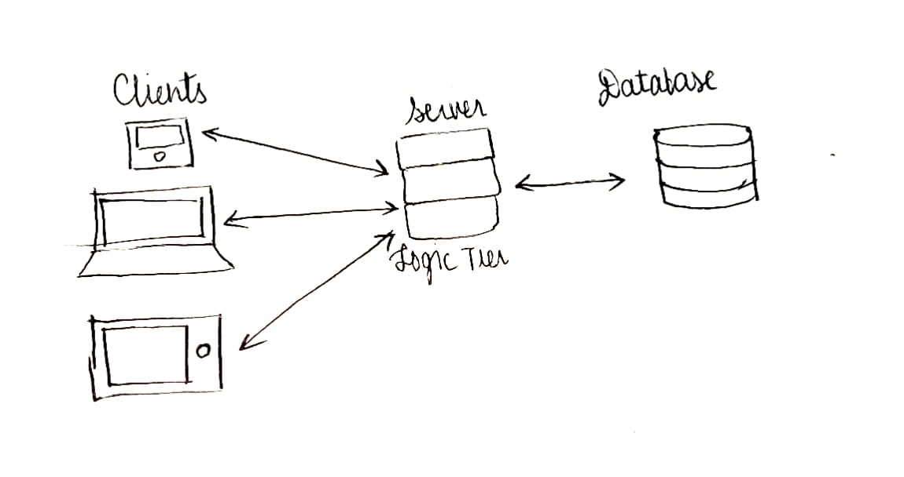
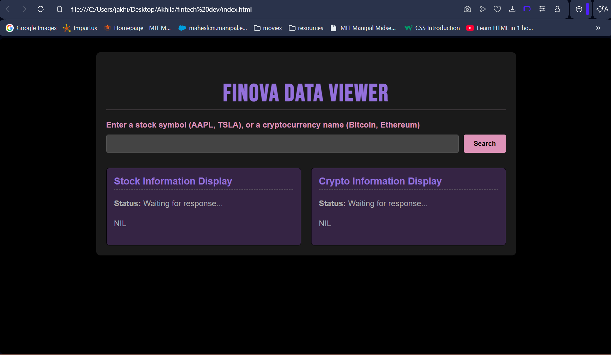
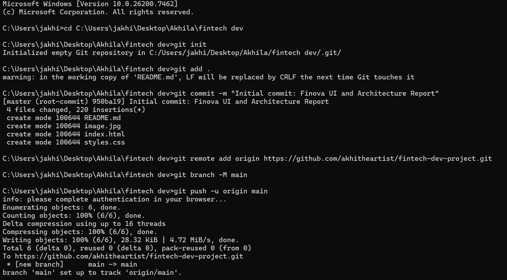

1. ***Client–Server Model***

A distributed application structure where clients request services and servers provide them. 

1. CLIENT

Any device or software that initiates communication by requesting data or services from a server. 

2. SERVER

 A powerful system that listens for and responds to client requests by delivering data or performing tasks.

3. CLIENT SERVER COMMUNICATION  
 i. User enters the URL   
 ii.  The browser contacts a DNS (Domain Name System) server to convert the domain into an IP address  
 iii. The browser sends an HTTP/HTTPS request to the server using the resolved IP address and establishes a connection.   
 iv. The server sends back website files.  
 v. Browser renders the webpage:

I. Interpreter: processes HTML  
II. CSS interpreter: applies styles  
III. JavaScript Engine: adds interactivity (using JIT compilation for performance) 

    d.	WHAT HAPPENS WHEN USER CLICKS SEARCH

1. When a user types a symbol, the symbol appears in the input box as expected.  
2. When the user clicks “Search”, the browser attempts to submit the form.  
3. The \<button\> inside a \<form\> (even if not explicitly declared) defaults to a submit action. Without JavaScript to intercept this action, the browser just tries to submit the data to the current page URL, causing a full, useless refresh.

   ***2\. Full-Stack Applications***

I. Front end development

The visible part of a website responsible for user experience. The user directly interacts with the front end portion of the web application or website.

II. Back end development

Server-side development focused on how a website functions. It manages the database through queries.

III. Database

An organized collection of data which helps in efficient retrieval, insertion and deletion of data from database and organizes the data in the form of tables, views, schemas, reports etc.

IV. API

An API defines the rules and methods by which one piece of software can request services, data, or functionality from another piece of software.

V. How these layers talk to each other

### **1\. Frontend to Backend** 

The Frontend initiates the conversation by sending an HTTP Request to a specific API endpoint on the Backend to ask the Backend for specific information or to perform an action.

### **2\. Backend to Database**

The Backend receives the Frontend's request, determines what data is needed, and sends a formal Database Query to the Database system. To retrieve, insert, or update the raw data stored in the database tables or documents.

### **3\. Database to Backend**

The Database executes the query and returns the requested raw data directly back to the Backend to provide the Backend with the necessary information to fulfill the user's request.

**4\. Backend to Frontend**

The Backend takes the raw data, formats it, and sends it back to the Frontend as an HTTP Response to deliver the requested information to the user's browser for display.

